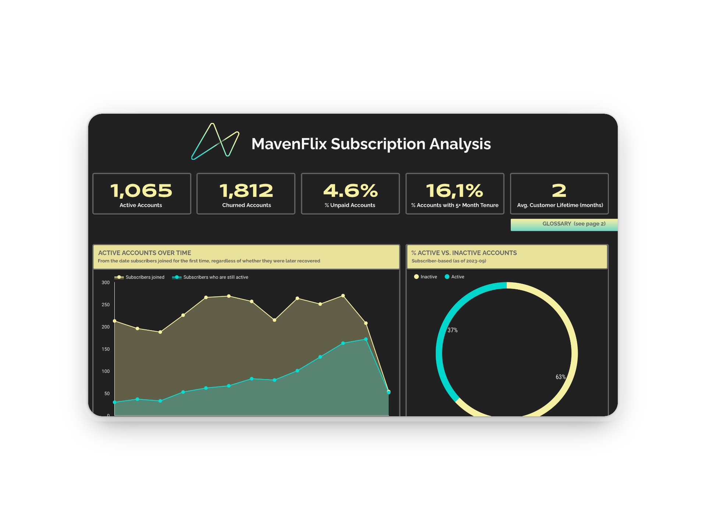

# Looker Studio Project: Subscription Analysis Dashboard

## 📖 Overview
Providing a comprehensive view of booking analysis and visualization for National Rail in the UK, helping track purchase trends, analyze Railcard usage, and identify refund patterns.
Providing a comprehensive view of subscribers behaviour, highlighting subscription trends, engagement patterns, and retention metrics.

👉 [Looker Studio Dashboard](https://lookerstudio.google.com/reporting/88314616-5a91-46d5-b720-d92d717b3196/page/p_jiovlfg6od)

## 📁 Data Model

→ `subscription_data.csv` 

| Column                 | Type      | Description                                                        |
|------------------------|-----------|--------------------------------------------------------------------|
| customer_id            | text      | Unique identifier for each subscriber.                              |
| created_date           | date      | Date when the subscription was created.                             |
| canceled_date          | date      | Date when the subscription was canceled, if applicable.            |
| subscription_cost      | float     | Cost of the subscription.                                           |
| subscription_interval  | text      | Frequency of the subscription billing (monthly, yearly, etc.).      |
| was_subscription_paid  | boolean   | Indicates whether the subscription payment was completed.           |

## ✅ Assumptions

| Status                 | Description               |
|------------------------|---------------------------|
| New Account           | Subscriber who has just signed up for the subscription. It's basically it's first step in their journey.  |
| Recurring Account     | Subscriber who has remained continuously active with the subscription, without any interruptions. If there was a break in activity, even if the subscriber has now been active for consecutive months, they are considered recovered.                        |
| Recovered Account     | Subscriber who previously stopped engaging with the subscription, but has returned.           |
| Fast-Churn Account    | Subscriber who has canceled the subscription within the same month they signed up and has not been returned.                                          |
| Churn Account         | Subscriber whose account has been canceled within a specific time frame and has not been returned (churn can only be voluntary in this case, the subscriber chooses to stop the subscription by not renewing).    |
| was_subscription_paid  | Indicates whether the subscription payment was completed.           |

